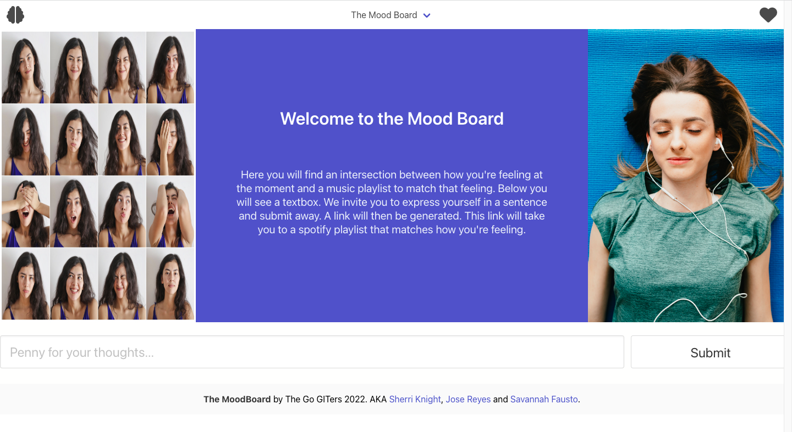
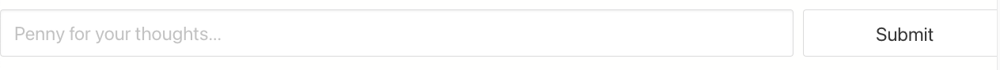
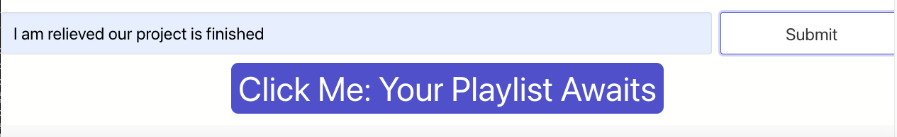

# A Breakdown of The Mood Board: A Place Where Your Music Matches Gets "The Vibe"

## Purpose of The Mood Board

This front-end application aims to connect a user's current emotion to a spotify playlist that matches calculated emotion. This is done using two API calls.

The first API call uses mood API. The user is asked to enter a sentence into the textbox on the application as seen here: 

Once the user clicks submit, this sentence is passed into the Mood API, which scores the sentence's emotion. We return the higest scoring emotion from this data and then pass this emotion in as a query parameter into our second API, spotify API.

Once this is done, the spotify API returns data that gives us access to a playlist ID. We concatenate this playlist ID at the end of the spotify link to generate a link. Once the functional link is generated, a "button" appears for the user to click to take them to the Spotify website to listen to their emotion Playlist, like so:

This link is saved into local storage where a user can access it any time by clicking the brain icon in the navbar or by clicking "Past" in the navbar dropdown menu.

Finally, the user can also click on the heart icon, or click Future from the navbar dropdown menu to see the developer's next steps for the application.

## Technologies Used:

The Mood Board uses Bulma as a third-party CSS framework. Most of the elements seen on the website utilize Bulma html elements and helper classes. Also, the Font Awesome website was used for icons found in the application.

The Javascript uses the jQuery library throughout the script. Finally, the Moment Library was utilized in the "Past Page" of our Web Application to let the user know what date and time a certain past playlist was recommended.

## Link to The Mood Board Demo Video

[The Mood Board Demo Video](https://drive.google.com/file/d/1h-LnN2WvXX50bPuzyiTS4hE-2bfpQY3T/view?usp=sharing)

## Link to The Mood Board and the GitHub URL:

[The Mood Board Web Application](https://reyes-jose.github.io/The-Mood-Board/)

[The Mood Board GitHub Repository](https://github.com/Reyes-Jose/The-Mood-Board)
